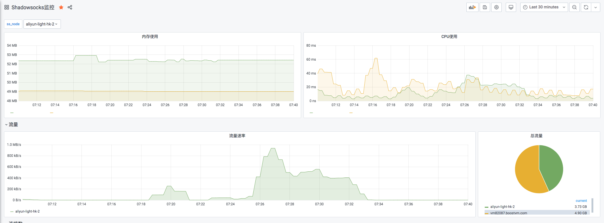
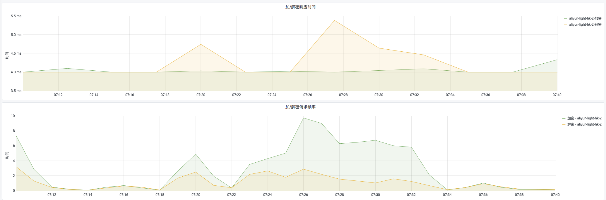
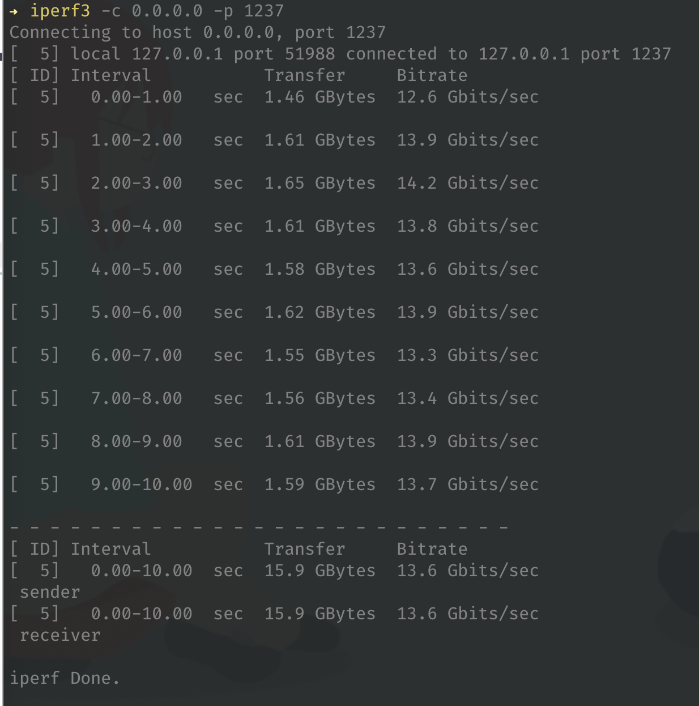
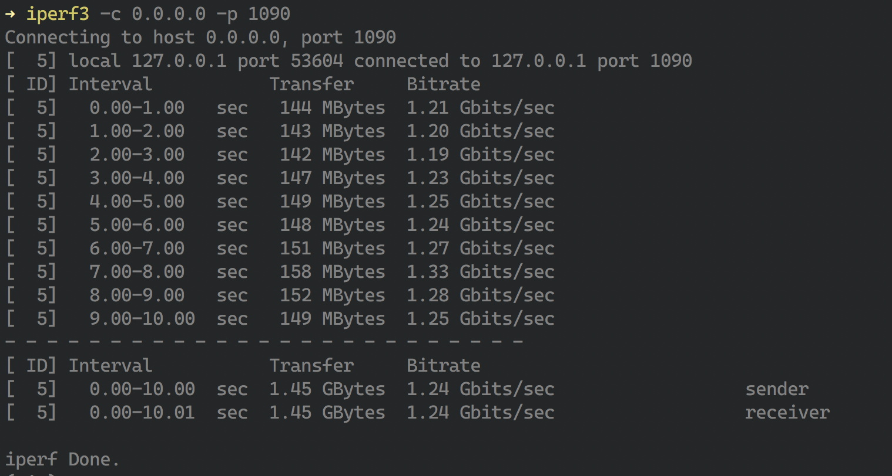

# aioshadowsocks

用 asyncio 重写 shadowsocks


## 视频安装教程

* 面板视频安装教程: [地址](https://youtu.be/BRHcdGeufvY)

* 后端对接视频教程: [地址](https://youtu.be/QNbnya1HHU0)

* 隧道对接视频教程: [地址](https://youtu.be/R4U0NZaMUeY)


## 使用

* 安装

``` sh
pip install aioshadowsocks
```

* 多用户配置

aioshadowsocks 将json作为配置文件,会读取当前目录下`userconfigs.json`作为默认的配置文件

```json
{
    "users": [
        {
            "user_id": 1,
            "port": 2345,
            "method": "aes-256-cfb",
            "password": "hellotheworld1",
            "transfer": 104857600,
            "speed_limit": 0
        }
    ]
}
```

同时也支持从http服务器读取配置文件，这时需要注入环境变量`SS_API_ENDPOINT`作为读取配置的api地址
* 注入环境变量

`export SS_API_ENDPOINT="https://xxx/com"`


* 启动ss服务器

```bash
aioss run_ss_server
```

## Docker Version

1. install docker

``` sh
curl -sSL https://get.docker.com/ | sh
```

2. install docker-compose

``` sh
sudo curl -L "https://github.com/docker/compose/releases/download/1.23.2/docker-compose-$(uname -s)-$(uname -m)" -o /usr/local/bin/docker-compose
```

3. apply executable permissions

``` sh
sudo chmod +x /usr/local/bin/docker-compose
```

4. run server

``` sh
docker-compose up
```


## 为什么要重写shadowsocks

主要想通过这个项目的推进来深入了解 `asyncio` 

另外我的一个项目: [django-sspanel](https://github.com/Ehco1996/django-sspanel) 依赖 `shadowsocksr` 

但该项目已经停止开发了，所以决定重新造个轮子

## 主要功能

* tcp/udp 代理
* 流量统计
* 速率控制
* 开放了grpc接口(类似ss-manager)
* **单端口多用户（利用AEAD加密在不破坏协议的情况下实现）**
* **prometheus/grafana metrics监控** （dashboard在项目的static/grafana/文件夹下）

## 监控dashboard






## 性能测试

> Shadowsocks本身是一个IO密集行的应用，但是由于加入了AEAD加密，使得SS本身变成了CPU密集行的应用
> 而Python本身是不太适合CPU密集的场景的，所以在AEAD模式中的表现不佳
> PS: 当然，其实是我代码写的烂，python不背锅

* Steam-Cipher-None(不加密 高IO)



* AEAD-Cipher-CHACHA-20(加密 高CPU)




## rpc proto

``` protobuf
syntax = "proto3";

package aioshadowsocks;

// REQ
message UserIdReq { int32 user_id = 1; }
message PortReq { int32 port = 1; }

message UserReq {
  int32 user_id = 1;
  int32 port = 2;
  string method = 3;
  string password = 4;
  bool enable = 5;
}

// RES
message Empty {}

message User {
  int32 user_id = 1;
  int32 port = 2;
  string method = 3;
  string password = 4;
  bool enable = 5;
  int32 speed_limit = 6;
  int32 access_order = 7;
  bool need_sync = 8;
  repeated string ip_list = 9;
  int32 tcp_conn_num = 10;
  int64 upload_traffic = 11;
  int64 download_traffic = 12;
}

// service
service ss {
  rpc CreateUser(UserReq) returns (User) {}
  rpc UpdateUser(UserReq) returns (User) {}
  rpc GetUser(UserIdReq) returns (User) {}
  rpc DeleteUser(UserIdReq) returns (Empty) {}
}
```
